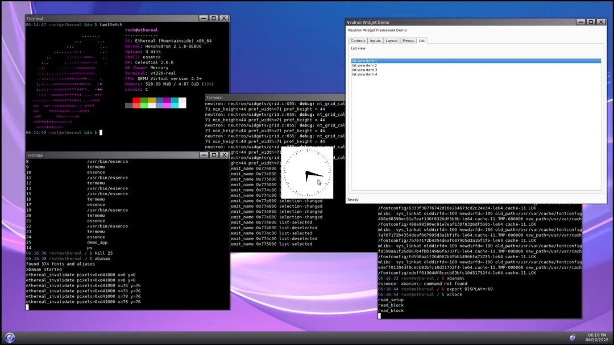

# Ethereal

A custom all-in-one hobby operating system.

## What is Ethereal?

Ethereal is a project with the goal of creating a fully functional OS with all components a modern OS would have.

It is **not** Linux-based, nor does it share any code with Linux at all. Rather, it uses a custom OS kernel.

## Screenshots

\
*Ethereal*

\
*Modern, 1080p desktop environment*

\
*Ethereal older main desktop environment with DOOM*

\
*Ethereal on Libera chat (#ethereal)*

## Features

- Full SMP-enabled kernel
- Advanced page cache that makes disk syncing fast
- Custom window manager (Celestial) and userspace
- USB support for xHCI controllers
- AHCI/NVMe disk support (technically IDE too, albeit a very poorly written driver)
- Networking stack with E1000 and RTL8169 network card driver
- Support for the `mlibc` C library
- Full ACPI support with the ACPICA library (with backup MinACPI library that doesn't have AML parsing)

## Project structure

- `base`: Contains the base filesystem. Files in `base/initrd` go in the initial ramdisk (for non-LiveCD boots) and files in `base/sysroot` go in sysroot.
- `buildscripts`: Contains buildscripts for the build system
- `conf`: Contains misc. configuration files, such as architecture files, GRUB configs, extra boot files, etc.
- `drivers`: Drivers for Hexahedron, copied based on their configuration.
- `external`: Contains external projects, such as ACPICA. See External Components.
- `hexahedron`: The main kernel project
- `libkstructures`: Contains misc. structures, like lists/hashmaps/parsers/whatever
- `libc`: Contains mlibc
- `userspace`: Contains the userspace libraries and programs in Ethereal

## AI policy

Ethereal **does not** permit coding assisted by LLMs to be present in the online repo.\
If such code does make it, it should be removed immediately.

My personal stance on AI is that its a tool with specific usages.

Artificial intelligence is good at:

- Reading through large codebases (assuming a human double-checks) such as Linux or NetBSD.
- Generating small, single-use test programs that never make it to upstream.
- Teaching certain small foreign concepts or asking small questions (when this information is not readily accessible)

Artificial intelligence is horrible at:

- Generating any type of kernel code
- Explaining why it is doing something/what something does
- Not overcomplicating the simplest of topics

Due to the above no AI code should ever be present in Ethereal.

As I have noticed (from myself and others) people tend to "overdose" on AI and become dependent on it.\
This only hurts you in the long run, causing your ability to program to falter.

For your own sake, please avoid using AI in the wrong ways.

**PRs containing AI-generated or suspected AI-generated code can be closed at any time.**

**THERE IS NO VIBECODING IN ETHEREAL.**

## Code notice

Ethereal's codebase is the result of over 2 years of effort.

In some areas, the code is extremely concise, well-written, and optimized.\
In other areas, it isn't - I learned as I made this project.

Take caution if using Ethereal as a source to learn how to make your own OS.

## Building

### ACPICA notice (READ THIS BEFORE BUILDING)

If you use ACPICA (**it is on by default**), you must download the tarfile from [here](https://downloadmirror.intel.com/834974/acpica-unix-20240927.tar.gz) and extract it to `external/acpica/acpica-src`

Alternatively, you can edit `conf/build/<arch>.mk` and set `USE_ACPICA` to 0.  

As of now the benefits of ACPICA is the ability to shutdown the system and hibernate, with support for the PCI IRQ routing table coming later (+ batteries).

### Building

To build Ethereal, you will need an Ethereal toolchain for your target architecture.\
The Ethereal toolchain can be found at [the repository](https://github.com/sasdallas/Ethereal-Toolchain)

Other packages required: `grub-common`, `xorriso`, `qemu-system`, `meson`, `ninja`

Edit `buildscripts/build-arch.sh` to change the target build architecture. \
Running `make all` will build an ISO in `build-output/ethereal.iso`

Currently, Ethereal's lack of filesystem drivers means that LiveCD boots are usually the best option.\
The initial ramdisk in a LiveCD is the sysroot, and if the OS detects the boot it will copy the initial ramdisk into RAM.

## Kernel arguments

A lot of times, Ethereal fails to load. This is expected. Please start a GitHub issue.

You can solve some problems by using 'e' to open a GRUB configuration and adding some kernel arguments to the end of the `multiboot entry`.\
Here is a small list:

- `--debug=`: Options are `console` and `none`. If `console`, will redirect kernel debug output to the screen. Useful for debugging
- `--noload=`: Comma-separated list of driver (.sys) files to not load. Problematic drivers: usb_xhci.sys, ahci.sys, ps2.sys (if you don't support PS/2),
- `--no-acpica`: Disable the ACPICA library and fallback to MinACPI implementation. Only useful in extreme cases.
- `--no-acpi`: Disable all ACPI implementations. Disables SMP as well.
- `--disable-smp`: Enable ACPI, but disable SMP
- `--no-psf-font`: Don't load the PSF font from initrd

## External components

Certain external components are available in `external`, `libc`, and other parts of the kernel. Here is a list of them and their versions:

- ACPICA UNIX* (Intel License): Version 20240927 [available here](https://www.intel.com/content/www/us/en/developer/topic-technology/open/acpica/download.html)
- libmusl math library (MIT License): [available here](https://github.com/kraj/musl)
- freetype (GPL license): [available here](https://sourceforge.net/projects/freetype/)
- mlibc (MIT license): [Ethereal fork available here](https://github.com/sasdallas/mlibc)
- tinf (zlib license): [available here](https://github.com/jibsen/tinf/)
- json-parser (BSD 2-clause license): [available here](https://github.com/json-parser/json-parser)

Certain external components are by the same developer, however may follow a different license:

- Essence (BSD 3-clause license): [available here](https://github.com/sasdallas/Essence)
- Neutron (GPLv3 license): [available here](https://github.com/sasdallas/Neutron) 

## Credits

A lot of Ethereal's design was inspired by [ToaruOS by klange](https://github.com/klange/ToaruOS) - thank you!

Ethereal's virtual memory manager design and other parts was inspired by [Astral by @mathewnd](https://github.com/mathewnd/Astral)

Some code from Astral was also used, credited where appropriate. A license file is included in `external/`.

The Ethereal logo and Mercury theme were designed by the artist [ArtsySquid](https://artsycomms.carrd.co)

## Licensing

Hexahedron and all other non-external components of Ethereal fall under the terms of the BSD 3-clause license (available in LICENSE).\
All files, unless specified in the copyright header, fall under this license. Any file without a copyright header is NOT protected by BSD 3-clause.

**LICENSING ISSUES:** If a file is found without proper commenting, immediately contact me (preferably through a public channel such as GitHub issues for transparency) directly to resolve it.

Ethereal's goal has **NEVER** been to take code, however if it does happen please contact me!
